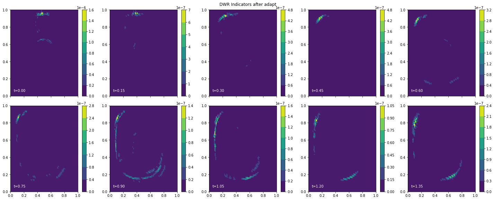

# Bubble Shear test case

## Introduction
We choose to solve the Bubble Shear test case based on McManus et al [2017]. It is a pure advection problem. While solving it on a uniform mesh, we can see some "smearing" of the solution field. Using $r$-adaptation, we should be able to do better than this. The paper in question uses an $r$-adaptive approach to high degrees of success, but uses a prescribed monitor function. We generate our monitor function instead, via DWR error indicators.

## Installation

To use the code and run the example, one must first install Firedrake on their system. A [link](https://firedrakeproject.org/download.html) to its install instructions. One must also install [Pyroteus](https://github.com/pyroteus/pyroteus) and [Pyroteus Movement](https://github.com/pyroteus/movement). TODO: Set up a Docker container with all this stuff.

Once you've activated your Firedrake venv, you can run the example file with
```
python3 shock_example.py
```
note: this file doesn't exist yet, but will soon. For now, the .ipynb contains everything

## Pictures worth 1000 words each
### Forward solution
The forward problem on a uniform mesh. The QOI is the end-time integral of the field u. Note the smearing of solution as the simulation goes on.

### Adjoint solution
The adjoint solution for our QOI problem. This tells us which cells contribute most greatly to QOI estimation at each time step.

### DWR Error indicators
The Dual Weighted Residual error indicators we define based on the true adjoint solution and a higher resolution approximation. These define our goal-based error estimate.

### Monitor function
A normalized version of the DWR error indicators that dictates mesh density as a function of space.

### Adapted meshes
Using the above monitor function to adapt our meshes, we see finer resolution on the right half of the domain.

### New forward solution
Using these adapted meshes, we see what our new solution looks like.


### Re-computed DWR estimates
In lieu of an analytical solution, we use the DWR error estimates once again and see that we have decreased their magnitude. For quantitative results, we will use a more sophisticated test-case.


## Conclusion
We are able to achieve goal-oriented $r$-adaptation in this CFD context, to get a better PDE simulation while maintaining good mesh quality. 
